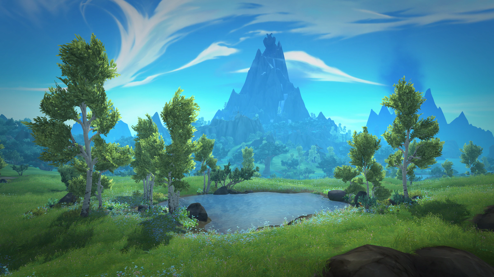

  

# wxl-grasswind

Makes the grass move.

In the stock client, grass is completely static, it doesn't react to anything. This module gives it a
bit of life:

- it sways gently, like it's caught in the wind;
- it parts when you walk through it, and settles back behind you.

Purely visual (no gameplay impact), and it all runs on the GPU, so no noticeable performance cost.

Tunable: wind direction and strength, speed, how much the grass parts when you walk through it, etc.
